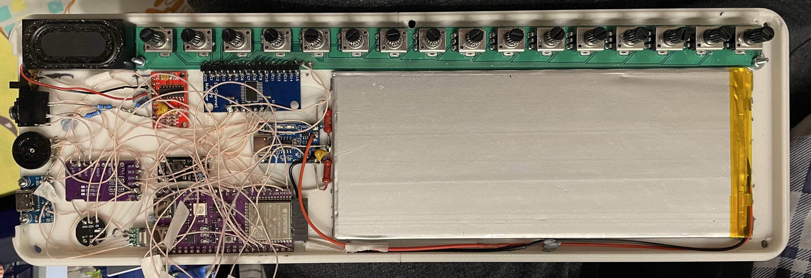
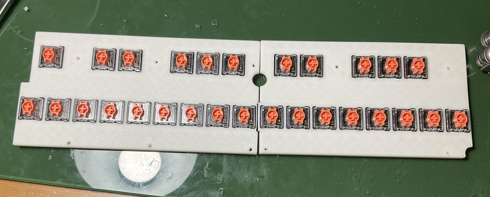
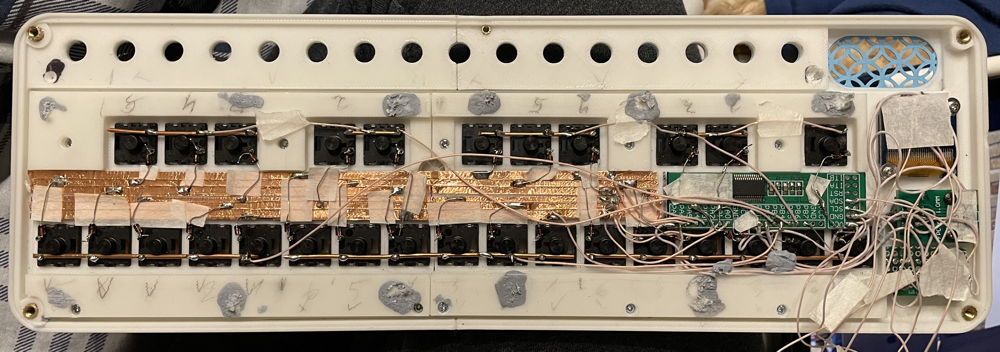
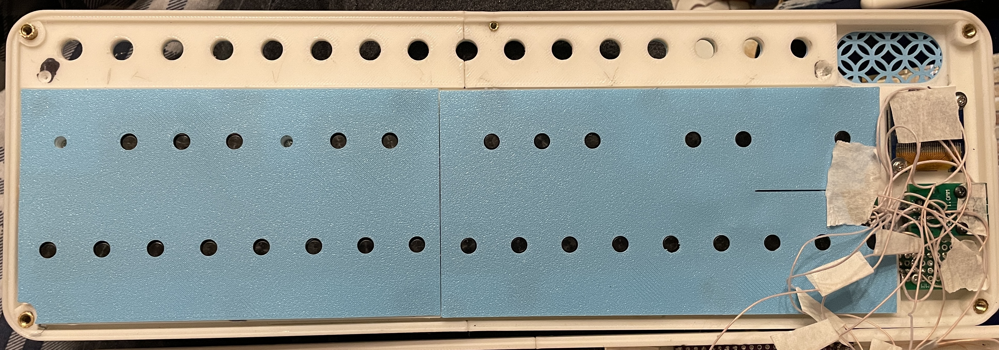
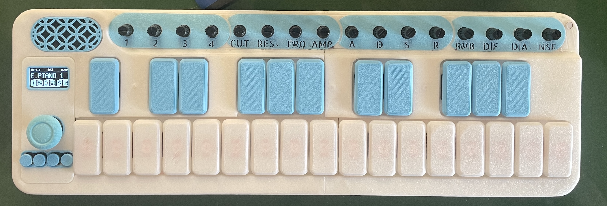

[![CC BY-NC-SA 4.0][cc-by-nc-sa-shield]][cc-by-nc-sa]

This work is licensed under a
[Creative Commons Attribution-NonCommercial-ShareAlike 4.0 International License][cc-by-nc-sa].

[![CC BY-NC-SA 4.0][cc-by-nc-sa-image]][cc-by-nc-sa]

[cc-by-nc-sa]: http://creativecommons.org/licenses/by-nc-sa/4.0/
[cc-by-nc-sa-image]: https://licensebuttons.net/l/by-nc-sa/4.0/88x31.png
[cc-by-nc-sa-shield]: https://img.shields.io/badge/License-CC%20BY--NC--SA%204.0-lightgrey.svg

# Spark Synth - Hardware
This repo is intended to host the hardware files and assembly information for [Spark](https://github.com/povle/spark-synth) - an open-source portable ESP32-based synth.

Important disclaimer: currently, this project is a prototype. If you really want to assemble it yourself, be prepared for a lot of drilling, sanding, double-sided-taping, soldering tiny wires and figuring stuff out on your own. You can contact [me on Reddit](https://www.reddit.com/user/Pashog/) and I might help if I have the time for that, but no guarantees here.

Moving forward I'm planning to design an easier to assemble V2 with everything mounted on custom PCBs, but I can't provide any timeline on that.

Feel free to modify and improve the design, but respect the licensing.

## Electronics - Bill of Materials
|   Component                                                                 | Function                         | **Comments**                                                                                                                                                                                                                                                                                                      |
|-----------------------------------------------------------------------------|----------------------------------|-------------------------------------------------------------------------------------------------------------------------------------------------------------------------------------------------------------------------------------------------------------------------------------------------------------------|
| ESP-32 S3 N16R8                                                             | Microcontroller                  | I've used some no-name devboard marked "S3 AI". Note the "N16R8" - the project does need a lot of PSRAM.                                                                                                                                                                                                          |
| PCM 5102A                                                                   | DAC                              |                                                                                                                                                                                                                                                                                                                   |
| PAM8403                                                                     | Amp                              |                                                                                                                                                                                                                                                                                                                   |
| RV09 (10 kOhm) (x16)                                                        | Potentiometers                   | Not sure what the exact model is, but mine are vertical with a plastic 12 mm long knurled shaft.                                                                                                                                                                                                                  |
| YANJUXING 4020 4 Ohm 3W                                                     | Speaker                          | Found it on Aliexpress. It's rectangular, 40mm x 20 mm, 14.3 mm tall. The dimensions are critical, it's a pretty tight fit.                                                                                                                                                                                       |
| Adafruit USB-C breakout board                                               | USB-C                            | Any peripheral breakout board you can find that has both power and data will do. I've used a copy of [this one](https://www.adafruit.com/product/4090). Ideally look for one with 5.1k pull-down resistors on CC1 and CC2 preinstalled, so that you are not limited to Type A - Type C cables.                    |
| TP-4056                                                                     | Battery charger                  |                                                                                                                                                                                                                                                                                                                   |
| CKCS BS01                                                                   | 5V Boost converter               | Given that it's only connected to the ESP, you probably should better look for a 3.7 - 3.3V stepdown converter and power it via the 3.3V pin directly. That should be quite a bit more efficient.                                                                                                                 |
| Custom PCB for Pots                                                         | Potentiometer wiring             | You can find the KiCad project in the repo. Not essential, you could just print a mounting plate and deadbug wire all the pots to the multiplexer, but I'm not sure how well the wires will fit, there's not a lot of space there.                                                                                |
| CD74HC4067                                                                  | Analog multiplexer for the pots  |                                                                                                                                                                                                                                                                                                                   |
| On-off switch                                                               |                                  |                                                                                                                                                                                                                                                                                                                   |
| ICS 43434                                                                   | Microphone                       | Optional, used only for the sampler.                                                                                                                                                                                                                                                                              |
| B103 10K 5Pin 16x2                                                          | Volume wheel                     | Note the 5 pins. Important if you want stereo line out.                                                                                                                                                                                                                                                           |
| TLZWLA PJ-307                                                               | 3.5 mm socket                    | Important to get a switching socket.                                                                                                                                                                                                                                                                              |
| 184x74x3.5 mm Li-ion battery (5000 mAh)                                     | Battery                          | TAKE PROPER PRECAUTIONS WHEN WORKING WITH THESE! Only use batteries with a built-in protection circuit, take extreme care not to short circuit or damage them. I've designed the whole project around these dimensions, so your battery **MUST NOT** exceed them. Carefully check the clearances during assembly. |
| Keychron Low Profile Silent Red (x29)                                       | Keyboard switches                | I think any low-profile switches with Cherry stems will work? Not sure if they are all exactly the same dimensions.                                                                                                                                                                                               |
| 1N4148 (x29)                                                                | Diodes for the keyboard matrix   |                                                                                                                                                                                                                                                                                                                   |
| MCP23017                                                                    | I2C IO Expander for the keyboard | Technically optional, i've only used it to minimize the amount of wiring between the top case and the bottom case. I think that ESP32 has enough pins left to connect the keyboard matrix directly, but that will make the wiring even more of a mess.                                                            |
| 128x64 0.96 I2C OLED                                                        | Display                          | There seem to be a lot of variants with slightly different mounting dimensions, so you might have to redesign the control panel for your specific one. Or just use double sided tape.                                                                                                                             |
| 4.5x4.5x7 mm button (x4)                                                    | Control panel buttons            | These were an afterthought. They don't feel that nice, are tiny but still barely fit. This should definitely be redesigned.                                                                                                                                                                                       |
| [GPD WIN 3 Joystick](https://www.aliexpress.com/item/1005005994714895.html) | Joystick                         | I bought this because it was the only one i could fit when i was planning to use the Korg Nanokey PCB for the keybed. Now there's a lot more space inside, so it should be doable to redesign it for something more common.                                                                                       |
| FPC 6 Pin 0.5 mm Breakout Board                                             | Breakout for the GPD joystick    |                                                                                                                                                                                                                                                                                                                   |

## Hardware - Bill of materials
| Component                      | Function                                      | Comments                                                                                                                                                                                                                                                                                                      |
| ------------------------------ | --------------------------------------------- | ------------------------------------------------------------------------------------------------------------------------------------------------------------------------------------------------------------------------------------------------------------------------------------------------------------- |
| 3D printer                     | 3D printing                                   | I've designed the project around my Bambu Lab A1 Mini, so almost any printer will be big enough.                                                                                                                                                                                                              |
| M3x6x5 Heat insert (x4)        | Connecting the case halves                    | I've screwed up (pun intended) with the top-right one, under the potentiometer recess. It pokes through the case (you can even see that in the photos). This should be redesigned. There's also a hole for a fifth heat insert in the center of the top case, but that would go straight through the battery. |
| M3x12 Screw (x4)               | Connecting the case halves                    |                                                                                                                                                                                                                                                                                                               |
| M2x2x3 Heat insert (x10)       | Connecting the keyboard plate to the top case | They are TINY. I had to screw an M2 bolt in and heat up the whole thing with a soldering iron so that no plastic gets on the threads.                                                                                                                                                                         |
| M2 Screw (x10)                 | Connecting the keyboard plate to the top case | I've had to cut them down to specific lengths so they fit...                                                                                                                                                                                                                                                  |
| eSun PLA+ White                | Structural components                         | Maybe switching to PETG would be a good idea.                                                                                                                                                                                                                                                                 |
| Bambu Lab Pla Matte (Sky Blue) | Everything blue                               |                                                                                                                                                                                                                                                                                                               |

## 3D printed parts
For now I'm providing them as a .3mf project, I will upload the .STEP files to the repo upon request (not sure if anyone will actually want to modify any of this),
### Bottom case
Consists of 3 parts: bottom_left, bottom_right, bottom_dovetail. I've used a lot of CA glue to connect them.
No supports needed, default 15% infill settings
 seem fine.

You will note that it's just a plain tub with no attachments for the components. I've printed it as a prototype to check how all my components and wires fit IRL and just stuck with it, using double-sided tape for securing most components. For the ones that need a stronger connection I've either hand drilled holes for M2 screws or used CA glue.

I'm sure I could do a much better job with wire management here, but I'm not touching this with a 10-foot pole until something breaks.

There are mounting holes for an IO side panel, but I still haven't designed one.

Some of the bottom screw holes are slightly wrong, because the version of the bottom case was designed for a different iteration of the top case. Can be fixed with a drill.

### Keyboard mounting plate
Consists of two independent parts: keyboard_left and keyboard_right. They are not initially attached to each other, both will be held in place when connected to the top case. After that you can glue them together with the connecting plate.

Note that the switches are attached sideways for better stability and easier wiring.

### Top case

This is the most complicated part of the build. The main part of it consists of two halves glued together with a thin dovetail plate. The control panel is simply held in with friction, you could add a dab of glue if needed.

The keys are wired in a 5x6 matrix with the rows and the columns connected to an IO expander. I've made traces using copper tape thinking that it would make the wiring cleaner. I really don't think that it did. I would advise to just use thin wire.

The buttons are wired directly to the 5 remaining pins on the expander. They are mounted on a screwed-in piece of perfboard.

I've printed thin covers so that the keyboard doesn't get shorted with something in the bottom case.

A lot of small glued-in decorative parts, should be mostly obvious. There's a separate white part glued on the pot panel for better surface quality. I've colored the space under the letters with a black sharpie and then glued the labels on. The labels were printed with a 0.2 mm nozzle, not sure if you could resolve them with a 0.4 mm.

The joystick knob is 3d printed, with a silicone cover made for Switch 2.

## Conclusion
Hope that this was useful or at least interesting. TERRIBLY SORRY for a lot of my design (in)decisions to anyone who might have decided to build this. Stay tuned for V2! Should be significantly friendlier to DIY.
